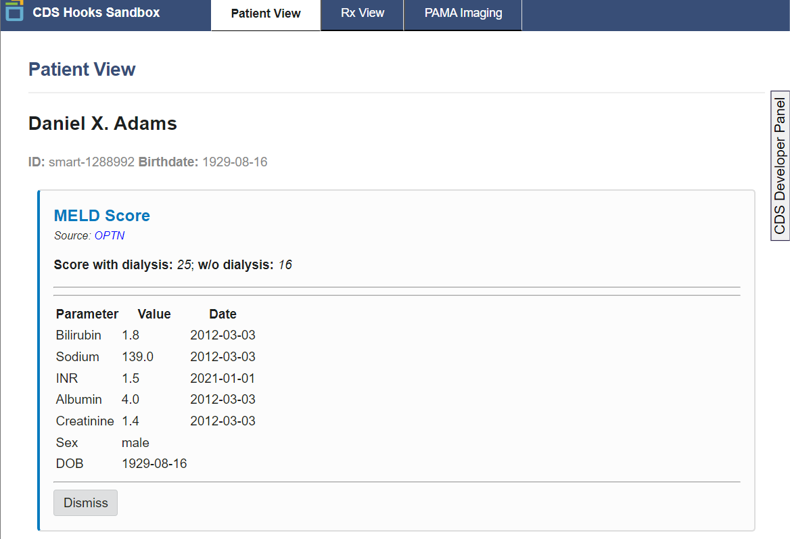

# MELD CDS Hook

This repository contains a implementation of a Clinical Decision Support (CDS) hook for calculating the MELD score whenever a patient's chart is opened in the EMR. The MELD score is a measure of liver disease severity and is used to prioritize patients for liver transplantation. The MELD score was initially developed to predict three-month mortality in patients who underwent transjugular intrahepatic portosystemic shunt (TIPS) procedures, amd has undergone multiple revisions.

This CDS MELD calculator uses the most recent revision: the [MELD 3.0 formula published by OPTN](https://optn.transplant.hrsa.gov/data/allocation-calculators/meld-calculator/).

## Dependencies

Poetry is used to manage dependencies. You can install it by following the instructions at [Poetry's official website](https://python-poetry.org/docs/#installation).

## Running the CDS Hook Service in Production Mode

To run the application in production mode, follow these steps:

1. Install the project dependencies by running:

   ```bash
   poetry install
   ```

2. Start the server with the following command:

   ```bash
   poetry run fastapi run meld_cds_hook/main.py
   ```

3. The server will be running at [http://localhost:8000](http://localhost:8000).

## Running the CDS Hook Service in Development Mode

To run the application in development mode, follow these steps:

1. Install the project dependencies by running:

   ```bash
   poetry install
   ```

2. Start the development server with the following command:

   ```bash
   poetry run fastapi dev meld_cds_hook/main.py
   ```

3. The server will be running at [http://localhost:8000](http://localhost:8000) with fast reload.

You can test the CDS hook using the [CDS Hooks Sandbox](https://sandbox.cds-hooks.org/).

## Running Tests

To run the tests, execute the following command:

## Test with Sandbox



With the server running, you can test the CDS hook using the [CDS Hooks Sandbox](https://sandbox.cds-hooks.org/). Click on the settings gear in the top right corner and enter the following URL in the \*Enter discovery endpoint url" field: [http://localhost:8000/cds-services](http://localhost:8000/cds-services). Then hit save. The sandbox should now attempt to discover the CDS hook and you should see the MELD CDS card displayed.

## Test with pytest

```bash
poetry run pytest
```
